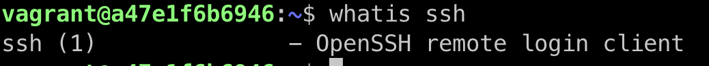

# Exercise 2

## Task

Research online for 10 more linux commands aside the ones already mentioned in this module. Submit using your altschool-cloud-exercises project, explaining what each command is used for with examples of how to use each and example screenshots of using each of them.

## Instruction

Submit your work in a folder for this exercise in your altschool-cloud-exercises project. You will need to learn how to embed images in markdown files.

## Solutions

### `base64` command

Base64 encode/decode data and print to standard output

**Usage Example:**

### `cksum` command

Checksum and count the bytes in a file

**Usage Example:**

### `du` command

Estimate file space usage

**Usage Example:**

### `find` command

Search for files in a directory hierarchy

**Usage Example:**

### `look` command

Display lines beginning with a given string

**Usage Example:**

### `ncal` command

Displays a calendar and the date of Easter

**Usage Example:**

### `printenv` command

Print all or part of environment

**Usage Example:**

### `whatis` command

Display one-line manual page descriptions

**Usage Example:**

### `whereis` command

Locate the binary, source, and manual page files for a command

**Usage Example:**

### `which` command

Locate a command

**Usage Example:**

## Further Study

<https://www.guru99.com/linux-commands-cheat-sheet.html>

<https://www.linuxtrainingacademy.com/linux-commands-cheat-sheet/>

<https://devhints.io/vim>
