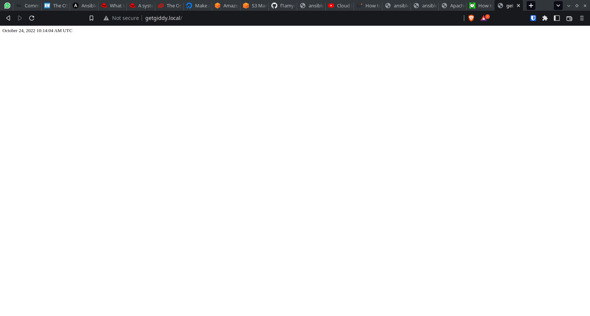

# Exercise 9

## Task

Create an Ansible Playbook to setup a server with Apache
The server should be set to the Africa/Lagos Timezone
Host an index.php file with the following content, as the main file on the server:

```php
<?php
date("F d, Y h:i:s A e", time());
?>
```

## Instruction

Submit the Ansible playbook, the output of systemctl status apache2 after deploying the playbook and a screenshot of the rendered page

## Outputs

Output of `systemctl status apache2`:

```txt
vagrant@ubuntu-focal:~$ systemctl status apache2
● apache2.service - The Apache HTTP Server
    Loaded: loaded (/lib/systemd/system/apache2.service; enabled; vendor preset: enabled)
    Active: active (running) since Mon 2022-10-24 11:13:06 WAT; 2min 26s ago
    Docs: https://httpd.apache.org/docs/2.4/
Main PID: 9321 (apache2)
    Tasks: 7 (limit: 1131)
    Memory: 15.0M
    CGroup: /system.slice/apache2.service
            ├─9321 /usr/sbin/apache2 -k start
            ├─9324 /usr/sbin/apache2 -k start
            ├─9325 /usr/sbin/apache2 -k start
            ├─9326 /usr/sbin/apache2 -k start
            ├─9327 /usr/sbin/apache2 -k start
            ├─9328 /usr/sbin/apache2 -k start
            └─9925 /usr/sbin/apache2 -k start

```

Rendered page:


